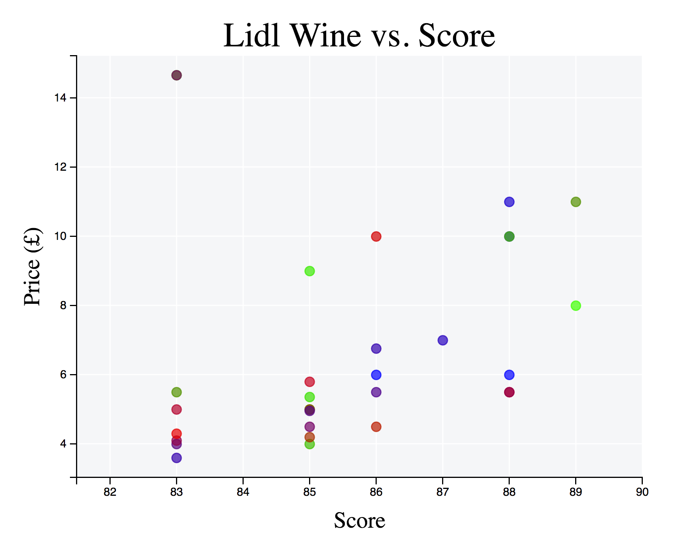

# Lidl Wine Optimiser

## About

I wondered whether the score that Lidl assigns to some of its wines was directly correlated with their price. This code uses `requests` and `BeautifulSoup` combined with the amazing OCR library `pytesseract` to find out!

## Installation

```
pip install -r requirements.txt
```

## Running
The repository already contains the results (`results.pkl`) and plot of the data (`results.png`) so if you run the code it will just plot out the data. However, if you delete those files the script will start afresh and print out its results as they are scraped from the Lidl website.

```
python main.py
```

## Results
Interestingly, only 25 of their wines are assigned scores, and those scores range from 83 to 88. Two wines have the highest score, one of which is £9.99 (Amour de Bordeaux, Sauternes) and the other is £5.49 (Forteza dei Colli Chianti Classico). If I was feeling snazzy I'd turn the plot into something interactive.


